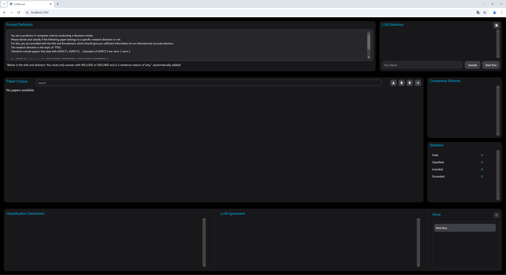
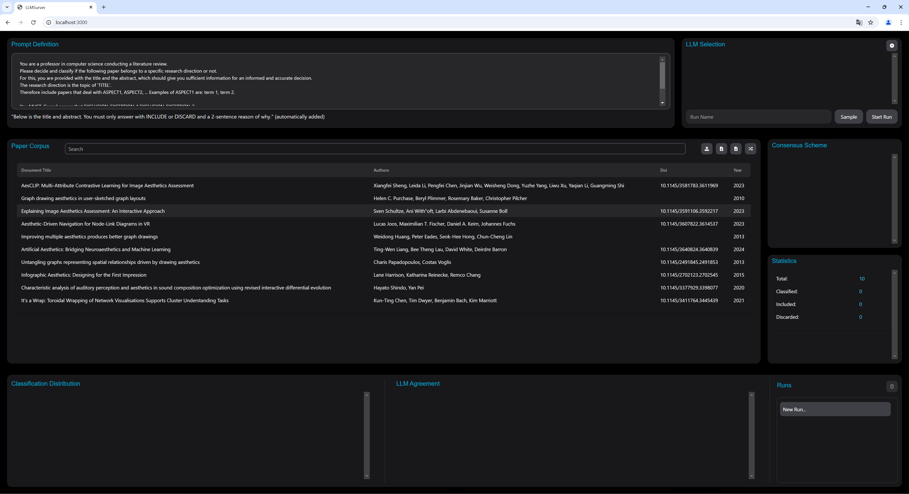
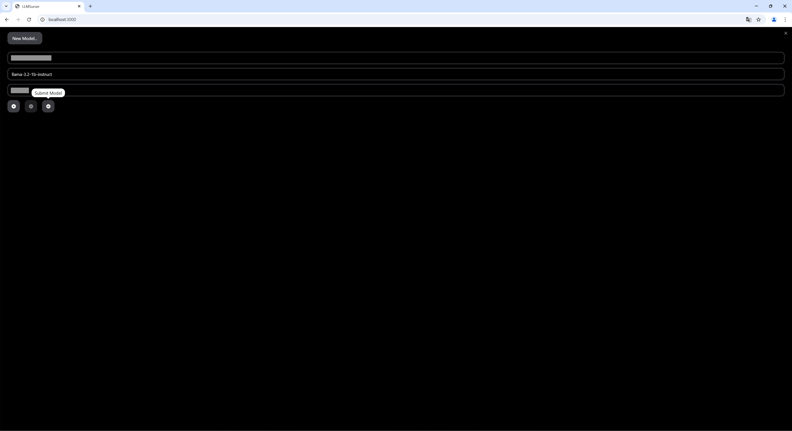
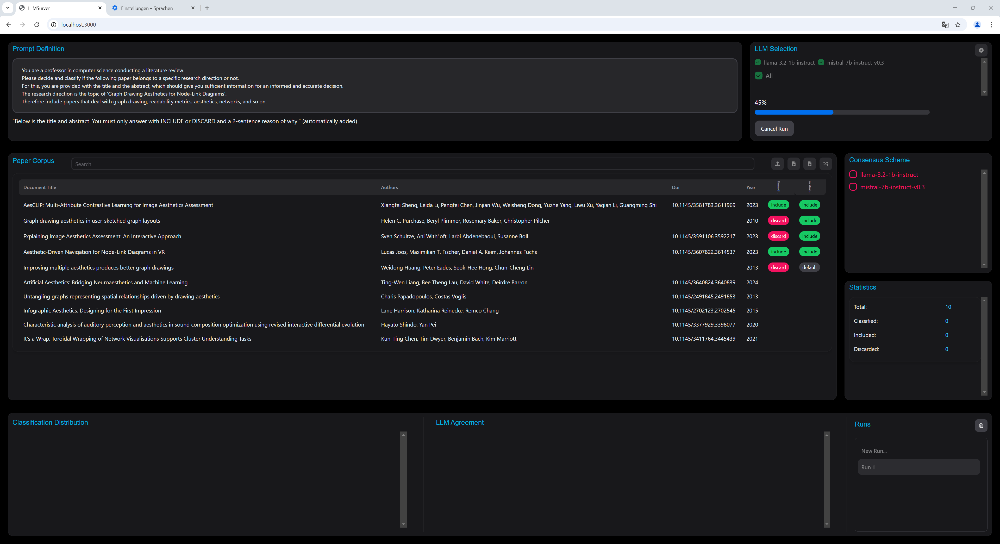
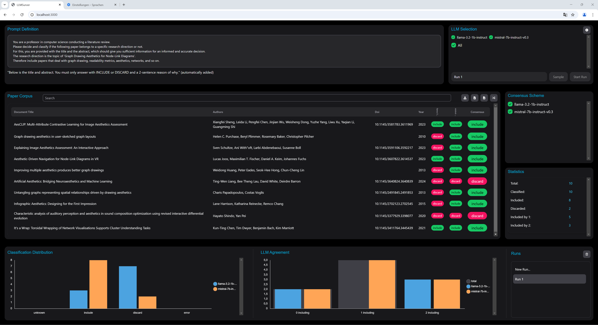

# LLMSurver

This repository contains the source code for **LLMSurver**, our tool to support paper corpus filtering for creating structured literature reviews.


## Architecture and Starting

The applications is dockerized and consists of two connected Docker containers:

* Frontend: The React frontend contains all graphical content and GUI elements
* Backend: The backend component is composed of a Python fastAPI application used to store and retrieve data, interact with the LLMs and run computionally heavy processes

The data is stored in a SQLite database in `backend/survey.db`.

To start the application, a system with Docker installed and an internet connection is required.
With the following command, the system can be started:

```Bash
docker-compose up
```

The system will be available under `http://127.0.0.1:3000` after installation.


## Repository Structure

* `frontend/`
  This folder contains the React frontend.

* `backend/`
  This folder contains the python fastAPI backend and the database file (`survey.db`).

* `docu/`  
  This folder contains the images used for documentation in this document.

## Citing this Repository

To reference this repository, please cite the original [publication](https://arxiv.org/abs/2407.10652):

```
Joos, Lucas, Daniel A. Keim, and Maximilian T. Fischer. "Cutting Through the Clutter: The Potential of LLMs for Efficient Filtration in Systematic Literature Reviews". arXiv preprint arXiv:2407.10652 (2024).
```

### BibTeX

```
@misc{joos2024cuttingclutterpotentialllms,
      title={Cutting Through the Clutter: The Potential of LLMs for Efficient Filtration in Systematic Literature Reviews}, 
      author={Lucas Joos and Daniel A. Keim and Maximilian T. Fischer},
      year={2024},
      eprint={2407.10652},
      archivePrefix={arXiv},
      primaryClass={cs.LG},
      url={https://arxiv.org/abs/2407.10652}, 
}
```

## How to use LLMSurver
After installation and accessing the url, the web application is ready to be used:



### 1. Import paper corpus
First upload some papers; this can be done with a .bib file or by pasting a DOI or BibTeX using the first or second button above the table.



### 2. Add LLMs

Using the button in the top right of the page, you can add new LLMs or modify existing ones. A host, model name, key, and further parameters (e.g. temperature etc.) can be set. If you run a local LLM on your machine, use `host.docker.internal` instead of `localhost` as hostname.



### 3. Define and start the classification

After defining LLMs, a run name, a prompt, and selecting the models of interest, the run can be started. In parallel, every paper is passed to the corresponding LLMs with the defined prompt, the results are stored in the database, and visualized live in the frontend.



### 4. Interact with results

When the run is completed, the results can be viewed, statistics can be analyzed, and the concensus scheme can be adapted until a sufficient classification has been reached. Further, the prompt can be improved and a new run can be started.

